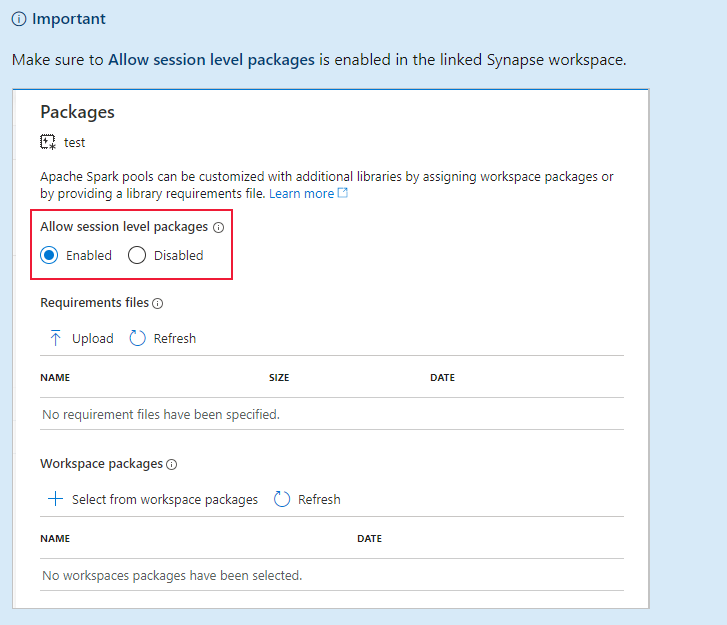
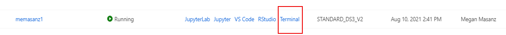
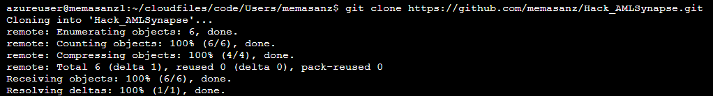
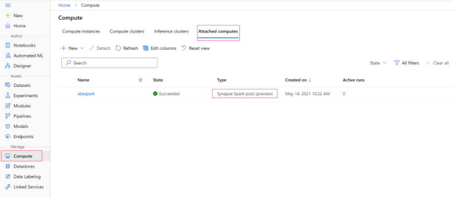

Hack_AMLSynapse
===============

Hackathon Leveraging AML & Synapse

1-Day Workshop: If most workloads will use Synapse as data repository. Given the
tight timeline, we will have the code base ready & tested in their environment
prior to the session (code tested in their environment if possible – from member
of their team to ensure smooth hackathon).

Possible Azure ML & Synapse Hackathon Agenda

Requirements:
-------------

-   Dedicated Sql pool for Scoring Azure ML workspace – ability to leverage
    compute resources Linked Service configured for Azure ML & Synapse Compute
    clusters for AML training

-   Each person in the training will have a Compute Instance they are able to
    attach to a Synapse Spark pool as the compute target.

-   Allow session level packages is enabled in the linked Synapse workspace. (In
    Synapse workspace Under Manage – Apache Spark Pools, Right click on 3 dots
    for spark and go to the ‘Packages’

>   Graphical user interface, text, application, email Description automatically
>   generated

Agenda
------

Proposed Agenda: 9-9:15 Intros and Agenda Review

9:15-10 Attach Synapse spark pool as AML compute target Data Exploration:
Interactive Spark Session on Synapse Spark Pool (inside a Jupyter Notebook)

10-12 Training Model - Inside Azure ML creating a pipeline to ingest and
transform data leveraging Spark pool and generating ONNX model.  
Data preparation/transformation will leverage the Spark pool, training will
leverage AML compute so we can leverage OpenSource packages and create image for
training.

12-1 Break Lunch

1-2 Continue model pipeline build & deploy

2-3 Loading Model in Synapse

3-4 Scoring Data in Synapse leveraging

**Challenge 1:**

In this challenge we will leverage a compute instance (a small machine) in Azure
ML to connect to our spark cluster for data wrangling. We will leverage the
open-source package azureml-synapse by doing a pip install of this package on
our compute instance.

1.1 Clone this repository:

On your compute instance, clone this repository so you can have access to the
notebooks leveraged during this hackathon.

To find your compute Instance –

In the terminal perform a git clone.

1.2 Review Environment

Since we will leverage the Spark Pool in Synapse for data wrangling we need to
confirm the attached compute is present in the AML workspace.

Your **Attached Compute** can be found in the AML workspace, let’s confirm.

1.3 Let’s get started.

\*Note:

To continue use of the Apache Spark pool you must indicate which compute
resource to use throughout your data wrangling tasks with %synapse for single
lines of code and %%synapse for multiple lines.

References for Hackathon Prep:
------------------------------

https://docs.microsoft.com/en-us/azure/synapse-analytics/sql-data-warehouse/sql-data-warehouse-predict
https://docs.microsoft.com/en-us/sql/t-sql/queries/predict-transact-sql?preserve-view=true&view=azure-sqldw-latest
https://docs.microsoft.com/en-us/azure/machine-learning/concept-onnx\#get-onnx-models
https://docs.microsoft.com/en-us/azure/azure-sql-edge/deploy-onnx
https://github.com/Azure/MachineLearningNotebooks/blob/master/how-to-use-azureml/azure-synapse/spark_job_on_synapse_spark_pool.ipynb
